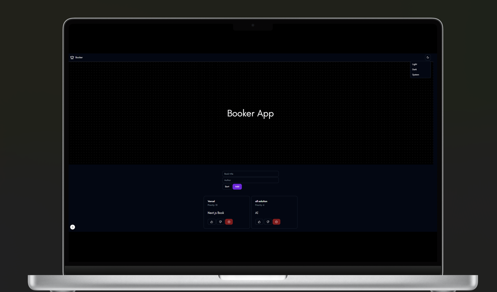

### Booker Quiz

Booker allows you to collect books to read. You can prioritize books by rating them. And with a simple sort button, you can sort books by rating. The ones with the highest ratings are at the top.



### How to Installation

1. install bun  

*** Linux & macOS *** 

``` curl -fsSL https://bun.sh/install | bash ```

*** Windows ***

``` powershell -c "irm bun.sh/install.ps1 | iex" ```

2. install bun-cli

``` bun install ```

3. Next.js installation

``` npx create-next-app@latest . ```

What is your project named? my-app

Would you like to use TypeScript? No / Yes

Would you like to use ESLint? No / Yes

Would you like to use Tailwind CSS? No / Yes

Would you like your code inside a `src/` directory? No / Yes

Would you like to use App Router? (recommended) No / Yes

Would you like to use Turbopack for `next dev`?  No / Yes

Would you like to customize the import alias (`@/*` by default)? No / Yes

What import alias would you like configured? @/* 

*** Default all Yes ***

4. Open your package.json file and add the following scripts:

```
"scripts": {
    "dev": "next dev",
    "build": "next build",
    "start": "next start",
    "lint": "next lint"
  }
```

5. Create the app directory

Next.js uses file-system routing, which means the routes in your application are determined by how you structure your files.

Create an app folder, then add a layout.tsx and page.tsx file. These will be rendered when the user visits the root of your application (/).

App Folder Structure
Create a root layout inside app/layout.tsx with the required <html> and <body> tags:

app/layout.tsx
TypeScript

TypeScript

```
export default function RootLayout({
  children,
}: {
  children: React.ReactNode
}) {
  return (
    <html lang="en">
      <body>{children}</body>
    </html>
  )
}
```
Finally, create a home page app/page.tsx with some initial content:

app/page.tsx
TypeScript

TypeScript

```
export default function Page() {
  return <h1>Hello, Next.js!</h1>
}
```
Good to know:

If you forget to create ```layout.tsx ```, Next.js will automatically create this file when running the development server with next dev.
You can optionally use a src directory in the root of your project to separate your application's code from configuration files.
Create the public folder (optional)
You can optionally create a public folder at the root of your project to store static assets such as images, fonts, etc. Files inside public can then be referenced by your code starting from the base URL (/).


### How to Run

1. Run the development server:

``` bun run dev ```

2. Open http://localhost:3000 with your browser to see the result.


*** This is a sample booker quiz project ***

``` The project is under MIT license ```